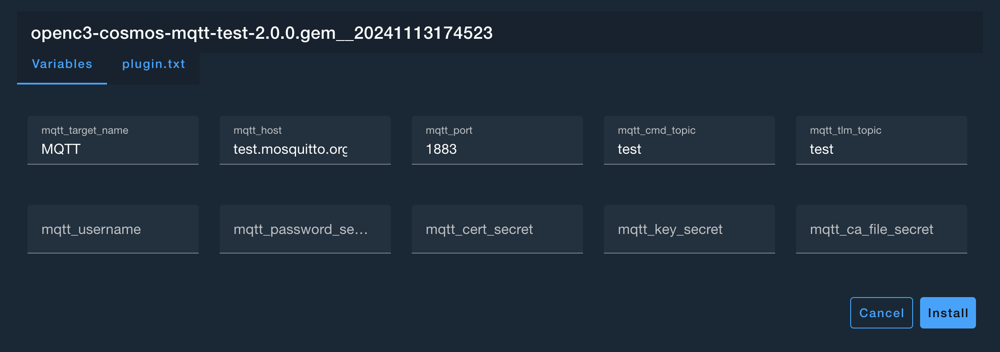
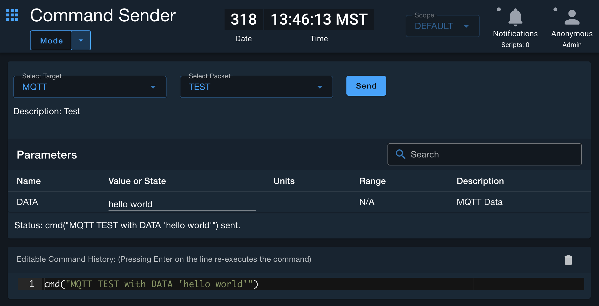
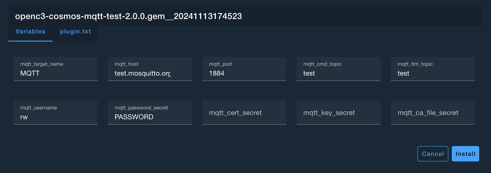
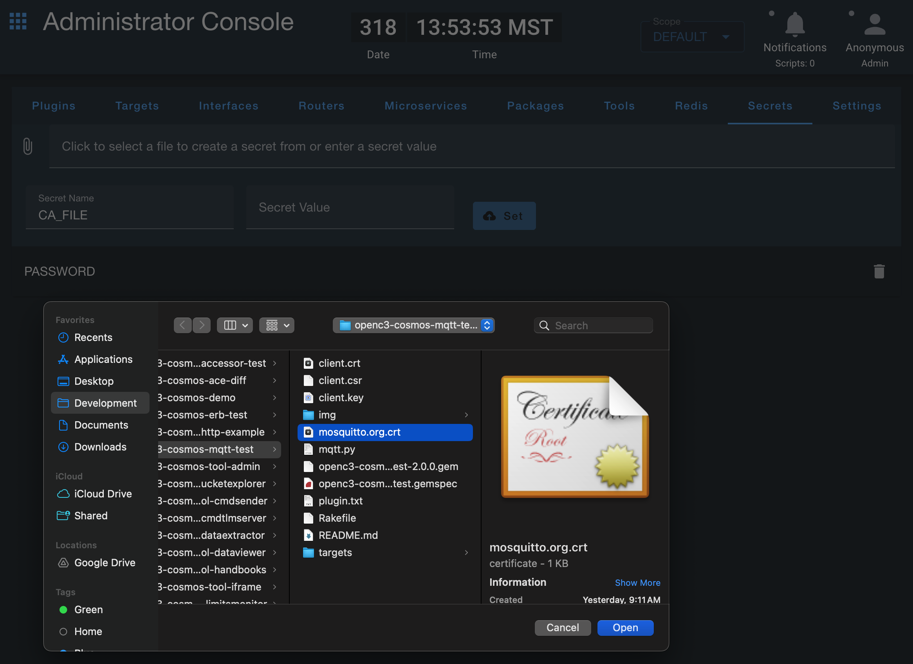
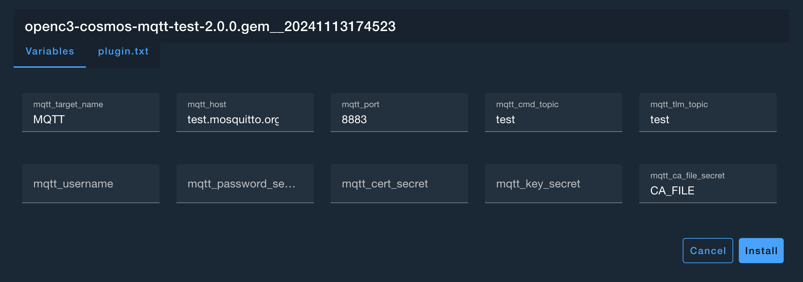

# Usage

The easiest way to test the MQTT interface is to interact with the server at https://test.mosquitto.org/. It has an unencrypted unauthenticated port, an unencrypted authenticated port, an encrypted unauthenticated port, and an encrypted authenticated port to test against.

## Unencrypted Unauthenticated

To connect to the unencrypted unauthenticated port install the plugin and change the values to the following:

The interface should connect at which point you can send whatever data you want in Command Sender:

And verify the result in Packet Viewer:

## Unencrypted Authenticated

To use the unencrypted authenticated port you need to first install a password secret. Go to the Admin / Secrets tab and create a secret name 'PASSWORD' with value 'readwrite'.

Then install the plugin using the following values. Note the port is 1884 and the username is 'rw':

THe interface should connect and you can send and receive data.

## Encrypted Unauthenticated

To use the encrypted unauthenticated port you need to first install the ca_cert file into the COSMOS Secrets. Go to the Admin / Secrets tab and create a secret name 'CA_FILE', click the paperclip and select the mosquitto.org.crt file.

Then install the plugin using the following values. Note the port is 8883, the username and password are cleared, and the mqtt_ca_file_secret is 'CA_FILE'. This matches the secret name we just created and will load the ca_file file into the plugin when it starts.

The interface should connect and you can send and receive data.

## Encrypted Authenticated

To use the encrypted authenticated port you need to install both the cert and key files into the COSMOS Secrets. Go to the Admin / Secrets tab and create a secret name 'CERT', click the paperclip and select the client.crt file. Create another secret named 'KEY', click the paperclip and select the client.key file.

Then install the plugin using the following values. Note the port is 8884, the username and password are cleared, the mqtt_cert_secret is 'CERT', the mqtt_key_secret is 'KEY', and the mqtt_ca_file_secret is 'CA_FILE'. This matches the secrets we just created and will load the cert file, key file, and ca_file into the plugin when it starts.

The interface should connect and you can send and receive data.
